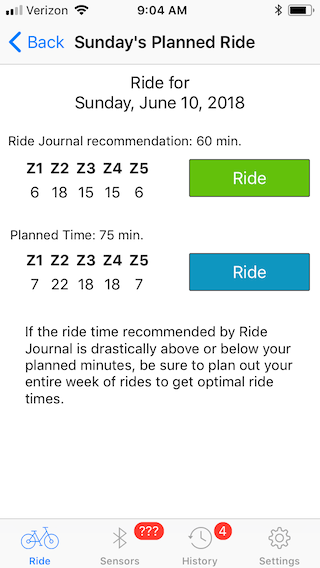

# JSON Stuff

RideJournal can provide RideBuddy with planned rides.

HTTP URL (POST) `https://www.cyclingfusiontrainingcenter.com/RideJournal/RideBuddyServer.svc/Ajax/Download`


Body

```
{
  "user": {
    "password": "j05|-|R0OLz",
    "userName": "markd"
  }
}
```

sample response is:

```
{
  "d": {
    "__type": "Download:http:\/\/www.RideBuddy.com\/Data\/",
    "ErrorCode": 0,
    "fullName": "Mark Dalrymple",
    "heartZones": [
      90,
      108,
      125,
      138,
      150
    ],
    "plannedRides": [
      {
        "__type": "PlannedRide:http:\/\/www.RideBuddy.com\/Data\/",
        "burnRate": [
          1.2,
          2.4,
          3,
          2.5,
          4.1
        ],
        "plannedDate": "2018-07-28T16:03:04Z",
        "plannedRideMinutes": 60,
        "zoneTargets": [
          4,
          14,
          11,
          11,
          4
        ]
      },
      {
        "__type": "PlannedRide:http:\/\/www.RideBuddy.com\/Data\/",
        "burnRate": [
          1.2,
          2.4,
          3,
          2.5,
          4.1
        ],
        "plannedDate": "2018-07-29T16:03:04Z",
        "plannedRideMinutes": 30,
        "zoneTargets": [
          2,
          4,
          4,
          4,
          2
        ]
      },
      {
        "__type": "PlannedRide:http:\/\/www.RideBuddy.com\/Data\/",
        "burnRate": [
          1.2,
          2.4,
          3,
          2.5,
          4.1
        ],
        "plannedDate": "2018-07-31T16:03:04Z",
        "plannedRideMinutes": 45,
        "zoneTargets": [
          3,
          9,
          8,
          8,
          3
        ]
      },
      {
        "__type": "PlannedRide:http:\/\/www.RideBuddy.com\/Data\/",
        "burnRate": [
          1.2,
          2.4,
          3,
          2.5,
          4.1
        ],
        "plannedDate": "2018-08-01T16:03:04Z",
        "plannedRideMinutes": 90,
        "zoneTargets": [
          8,
          22,
          19,
          19,
          8
        ]
      },
      {
        "__type": "PlannedRide:http:\/\/www.RideBuddy.com\/Data\/",
        "burnRate": [
          1.2,
          2.4,
          3,
          2.5,
          4.1
        ],
        "plannedDate": "2018-08-02T00:00:00Z",
        "plannedRideMinutes": 30,
        "zoneTargets": [
          0,
          0,
          0,
          0,
          0
        ]
      },
      {
        "__type": "PlannedRide:http:\/\/www.RideBuddy.com\/Data\/",
        "burnRate": [
          1.2,
          2.4,
          3,
          2.5,
          4.1
        ],
        "plannedDate": "2018-08-03T00:00:00Z",
        "plannedRideMinutes": 60,
        "zoneTargets": [
          3,
          10,
          8,
          8,
          3
        ]
      }
    ],
    "rideTypes": [
      {
        "__type": "RideType:http:\/\/www.RideBuddy.com\/Data\/",
        "key": "Class Builder",
        "name": "Class Builder"
      },
      {
        "__type": "RideType:http:\/\/www.RideBuddy.com\/Data\/",
        "key": "Digital Class",
        "name": "Digital Class"
      },
      {
        "__type": "RideType:http:\/\/www.RideBuddy.com\/Data\/",
        "key": "Indoor",
        "name": "Indoor"
      },
      {
        "__type": "RideType:http:\/\/www.RideBuddy.com\/Data\/",
        "key": "Outdoor",
        "name": "Outdoor"
      },
      {
        "__type": "RideType:http:\/\/www.RideBuddy.com\/Data\/",
        "key": "Unspecified",
        "name": "Unspecified"
      },
      {
        "__type": "RideType:http:\/\/www.RideBuddy.com\/Data\/",
        "key": "Virtual Ride",
        "name": "Virtual Ride"
      }
    ],
    "threshold": 150,
    "userName": "markd",
    "userType": "Rider",
    "version": "1.0",
    "weight": 160
  }
}
```

### Notes

Even though sometimes RideBuddy shows two possible rides:



Only one ride is sent (see July 29 above), but the code adds up the times, and if it's
off from `plannedRideMinutes` that supresses some threshold, it reverse engineers the 
the % of time in zone, and applies that to the planned minutes.
