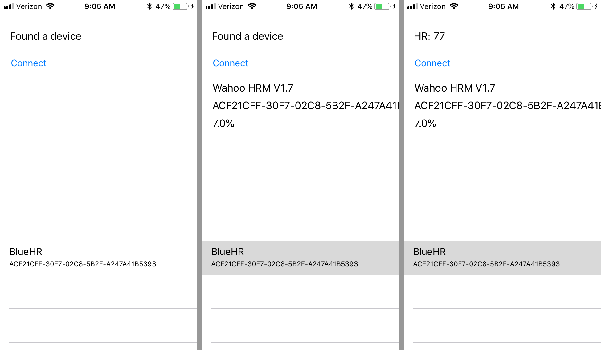

# Wahoo API Notes

Wahoo Fitness is an Atlanta-based company that makes electronic gadgets for 
fitness, with a focus on cycling.  They had popular bridging hardware for ANT (Garmin's
wireless protocol) so you could read ANT-based heart rate monitors and cycle computers
from an iPhone. This hardware had a corresponding API that was pretty easy to use.
Recently they've been adding bluetooth hardware and support and have stopped selling
their ANT dongle.

For BuddyKit, I'm investigating using their API for connecting to devices.  Why not just
use core Bluetooth directly?  Mainly because there's a number of classes of devices
that RideBuddy uses: heart rate monitor, power meter, speed sensor, cadence sensor, 
plus a combined speed and cadence sensor.

* [Wahoo Fitness](https://www.wahoofitness.com)
* [Developer page](https://www.wahoofitness.com/development-api)
* [API Docs](http://api.wahoofitness.com)


### Wahoo Playground

In `experimental/markd` there's `WahooPlayground` with a spike using the API:

* can we find a heart rate monitor?
* can we get some info from it?
* can we connect?
* can we poll it for the last-reported heart rate?

And it seems to work:



## API

I haven't really read their API in detail (as far as I can tell, there's not really
a high-level "here's how everything fits together), instead there's a pile of javadoc-style
generated pages.

WahooPlayground is cribbed from their demos, putting things in the places where the
demo put them (such as AppDelegate). BuddyKit will need to put them into better places
(since a framework doesn't have access to appDidFinishLunching...)

### Configuration

Need to make sure the framework search paths and linking objects (like `-lObjc`) are set up
corectly. Also need a bridging header for importing the Wahoo SDK headers.

### Searching for devices

`WFHardwareConnector.shared()` is the main access point.  In the app did finish launching
we need to configure it:

```
connector.enableBTLE(true)
connector.setSampleTimerDataCheck(true)

connector.delegate = self
connector.sampleRate = 0.5  // 500ms, or 2hz

connector.settings.useMetricUnits = Locale.current.usesMetricSystem
```

There's also a pile of delegate methods for reporting connecting a sensor, a sensor
changed state, etc.  Didn't do much with those outside of logging stuff.

`hardwareConnectorHasData` looks very useful - saying that something has new data.


### Getting info from them

Wahoo's sample code calls it "Discovery", using a `WFDiscoveryManager`. It also has
a local cache of found devices.

When starting a discovery:

  * Clear cache of found devices
  * set the discoveryManager delegate
  * call `discoverySensorTypes` giving it a network type (ANT and/or BLE)

As things are discovered, delegate methods get called.

`discoveryManager(_, didDiscoverDevice:)` is when something new was found. It gets
passed a `WFDeviceInformation` which includes things like name, battery level, signal
strength, and if it's currently connected.

Here we just toss it into our found devices pile

There's also a `didLooseDevice` _[sic]_ for when a device goes away.


### Connecting

The tableview has behind it the array of WFDeviceInformations. Selecting one of those
updates the UI by pulling the information - name, identifier, and signal strength.

Tapping the Connect button actually does BLE connection/pairing/magic to the device.

Order of operations one here:

* Get a set of _connection parameters_ from the device, 
  using `device.connecitonParamsForAllSupportSensorTypes` _[sic]_
* Make a dictionary that maps NSNumber -> NSObject
* Get a hold of the `WFHardwareConnector.shared()` dude
* Walk the parameters  (of type `WFConnectionParams`
* do `requestSensorConnection` from the connector, with a given proximity
* Stash this in the map with key of the sensorType (e.g. heart rate monitor), and this
  new connection object
  - looks like each parameter is for a particular sensor type, maybe sensor type + network

I'm not seeing any delegate jazz to tell us when it's connected, but I may have stopped
before getting that far.

### Polling for heart rate

Have a timer that polls. For real, probaby should hook in to the `WFHardwareConnector` 
hasData delegate method.

* Walk the supported sensor types of the selected device (the one selected in the
  table view)
* get the type number (which is also the key in the map dictionary
* Get the connection object, cast it to `WFHeartrateConnection`
* ask it for its heart rate data.


