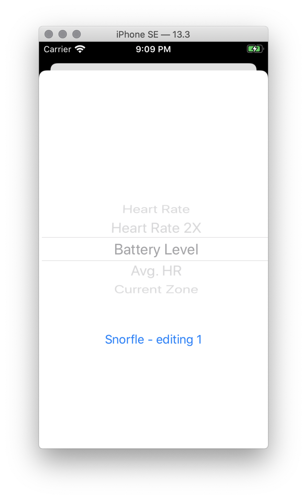

# MarkD SwiftUI / Combine NerdCamp

Written 17-January-2020

TL;DR: Combine is nice. Swift compiler error reporting is annoying.  Swift UI is *really* nice.  Making custom views is a joyful experience. Honestly impressed with how well they both are working.

In January of 2020, Mikey Ward and I took our 2019 Nerdcamp that got postponed. We went to Historic Banning Mills (a.k.a. HBM) for a week to dig into Combine and Swift UI, the hot new tech for iOS that was announced at Apple's World Wide Developer Conference in June of 2019.

## Prep

Our plan was to do pre-learning beforehand, such as watching WWDC sessions, working through tutorials, and do some poking around with the intent of hitting the ground running going beyond Hello World.

I looked at three books:

* The Ray Wenderlich group's [_Combine: Asynchronous Programming with Swift_](https://store.raywenderlich.com/products/combine-asynchronous-programming-with-swift). I completed all but the last chapter (which has SwiftUI, so I deferred that chapter til I had some SwiftUI chops) before arriving at HBM. Also used it as the basis for three talks at my local CocoaHeads.  This is a very good book, well organized, and well written.  I highly recommend this.

* The Ray Wenderlich group's [_SwiftUI by Tutorials_](https://store.raywenderlich.com/products/swiftui-by-tutorials).  This book is not nearly as good.  It's strangely organized, and the writing style is very cheerleader-y and kind of obnoxious.  I stopped reading partway through.  I do not recommend this.

* Dan Steinberg's [_A SwiftUI Kickstart_](https://editorscut.com/Books/SwiftUIKickstart/bookPage.html).  This book is very good, definitely aimed at the experienced developer who wants to get up to speed quickly. Dan's writing style is enjoyable to read and doesn't get in the way of learning the material.  I highly recommend this.  I started the book monday morning at HBM and completed it part-way through the day tuesday.  I also like that everything was app-based, not confined to the preview panel. (that's especially important as you'll see later...)


## The Project

See appendix for details - I find it endlessly fascinating, but most folks probably don't.

TL;DR - I've got in the app store a real app that does real stuff for real users, which I'll be using for a cycling Winter Training, and am using that to drive my Combine/SwiftUI learning.


## The Moving Pieces

This app is pretty much begging for a Combine-style architecture.

* The web service aspect is pretty bog-standard "talk to a server, get a JSON payload, peel it apart, use the included parts to control the rest of the app". Combine makes these things nice

* Heart rates come in from a bluetooth device.  It'd be cool to have a publisher that emits readings as they come in.  Subscribers can take that data and process it, like display the current heart rate. Or use the user's Zone settings and calculate the current time in zone.  Or capture the max heart rate.  Or aggregate multiple readings and average them.

* The various "meters" can just be subscribers to various publishers, say a Current Heart Zone Publisher, and then transform the numerical values  as appropriate for the data being displayed

* The heart rate strip-chart can subscribe to a rolling window of prior heart rate readings.

and so on.


## The Final Product

As of the end of the week, I was able to get a number of pieces working, and some smoke-and-mirrors for the other things.

The repo is private off my github account, but I've forked it into the BNR github: https://github.com/bignerdranch/BNR-MarkD-RideBuddy

Here's a screen recording: [ride-buddy-demo.mov](assets/ride-buddy-demo.mov).  It's using heart rate data recorded by this app previously, and is now being fed through a timer-based publisher. (but it's real data)


Specifically I got done:

* A Combine pipeline that fetches and decodes stuff from RideJournal - even with error reporting.

* Core BlueTooth subscribed to a heart rate monitor, and I emit those values through a publisher. Same with the device battery level

* Using that publisher, I recorded some actual heart rates as I did some walking around HBM, and then created a time-based publisher that fed in those recorded values so I could develop in the simulator.

* I have other publishers that tie in to the heart rate source that perform calculations (like average heart rate)

* A MeterDataSource class that connects the combine sources with a SwiftUI view for displaying the info to the user. Also have the start of a chooser of available meters to allow the user to change a meter

* A sample six-up page with six meters. Tapping on a blue meter brings up the chooser (but doesn't actually update stuff)

* A custom view which shows the user's heart rate along with some history, with the different heart zones colored with the same gradients as the original software.

|-------|--------|
|  |  |
|   |  |


### Next steps

* I want to build a nicer bluetooth pipeline. It'd be so cool to be able to do

```
Bluetoothness()
.scanForDevices(heartRate)
.map { to a list for displaying in a UI. User chooses one }
.subscribeTo(heartRate)
.attachToMeters
```

But handling multiple devices in-flight with a singleton BlueTooth central manager
and a huge pile of delegates sounds hard.

* I need to revisit how I'm making the publishers and scooting them around. The Environment kind of let me down in places, trying to figure out how to inject things later on after views have been created.  I made a service locator thing because I needed to be able to find publishers outside of a SwiftUI context, so need to unify them some how.

* I still need to do the app plumbing for letting the user choose rides (even though I do have the data structures in-place. It should be prett plug-and-chug), starting a ride, and having a custom view that shows ride progress

* Need to do the buckets!  I have a pile images that I use Core Graphics, overlapping color fills and white highlights to get the glistening-paint effect.  Need to figure out how to do that kind of stuff in SwiftUI.

* Need to do aggregate the data (in a bizarre JSON payload format) and upload to ride journal

Given how quickly I chewed through things this week, most of these should be afternoon-sized projects.


## Take-Aways

* I love that Combine forces you to deal with errors.  I have better error handling and reporting in this version than I do in the real app.

* The bad part of Combine is I spent a *lot* of time babysitting the compiler, making sure types lined up.  The current Swift error reporting is frustrating. I can have a ton of errors in place that are causing downstream-in-the-source-file errors, but the real errors don't get reported. So I screwer around with the downstream errors, get them fixed, and suddenly have a dozen errors which I need to fix. And then I'd have to undo the "error fixes" I did before. Also, some of the errors reported were pretty inscrutable and took some googling to figure out what the root cause was.  Oftentimes I'd take out other code randomly until I could get something compiled, and then slowly reintroduce it until I could get a decent error message.

* SwiftUI is really easy to use (aside from similar error-message problems). I'm totally in love with the custom view creation model.  I did in half a day what took me a couple of days with Core Graphics and a lot of manual coordinate calculation.  I'm still hazy on exactly how the data interchange works, and making sure things have the right @State/@Binding/@Published/@ObservableObject. Things I thought would Just Work didn't (c.f. questions in slack). I have some stuff that works, but it's ugly, and I'm sure there's probably a better way.

* Xcode is still its horrible self.  In my case, if I used the SwiftUI preview panel, I'd eventually get a system-wide SPOD and have to hard-reboot. I had to force-reboot (or wait a couple of minutes for the OS X watchdog to reboot the system) five times on monday and tuedsay. I eventually turned off the SwiftUI preview, and didn't have the SPOD monster, outside of one time when I switched simulators twice - after the second simulator switch, the system locked up.  So maybe the SwiftUI preview is awesome, it's not worth having to reboot and rebuild my work environment.  FB7534954 - Xcode 11 simulators + Catalina == system wide lockups.

* There were some detail bugs here and there in SwiftUI (such as with tables +  navigation sometimes not working) but for the most part, stuff was working well.  I would not be sad saying good-bye to AppKit.

* From talking to other folks (like some of my CocoaHeads), it's still kind of rough for being the exclusive app toolkit, but I think we should be at least demoing it during the Essentials and/or Advanced iOS classes. It's got the kind of "let me just worry about the stuff I want to do" joy that's gone out of UIKit for me over the last several years.

# Appendix A - Nerdcamp and location

Nerdcamps are awesome.  It was a lot like working on Krendler during Clash, butithout the sleep deprivation and failed personal hygiene.  My learning cycle is

* read about something
* mongo hit things with a hammer until it work
* learn from the experience
* fix things with the new real experience, and repeat until it's all internalized.

Without being able to concentrate on this for full work days, it would have taken me a month to get to the point where I am now with the app. I probably wouldn't have had the gumption to do this on my off-hours. I hadn't so far.

The location, Historic Banning Mills, is well known to Ranch old-timer Nerds. It's a place where we taught open enrollment classes for years.  It's in the middle of nowhere (Whitesburg), poor connectivity of any kind outside of the main lodge. The grounds are beautiful, the staff friendly, the dinners were fantastic, and the place was quiet.  Janary is a slow time for them, so we pretty much had free run of the place. I highly recommend it for other folks wanting to nerdcamp away from the office.

  
# Appendix B - Ride Buddy Buckets.

I have an app in the store, "Ride Buddy Buckets", which is an accessory app for an online cycling training program website we call [Ride Journal](https://www.cyclingfusiontrainingcenter.com/RideJournal/RJHistory.aspx?index=Plans). [Docs and screenshots of the current app are available](https://github.com/bignerdranch/BNR-MarkD-RideBuddy/blob/master/design-docs/README.md)

The Winter Training program is a multi-week (8-16 depending on the individual's choice) which takes them through base-building through developing speed and power. It's based on Sally Edwards' heart zones(tm) method, with corroborating research from Carl Foster of the University of Wisconsin.

The user uses the Ride Journal website to plan their workout times for the week. Ride Journal figures how much time the user should spend in five different "heart zones", each zone based on two ventilatory threshold values that can be determined with the Foster Field Test, or via blood lactate threshold testing, or darth-vader mask systems like New Leaf metabolic testing.

So, Ride Journal knows "this week you need to spend 25% of your time in Zone 1 (active recovery), 45% in Zone 2 (Endurance), 20% in Zone 3 (Aerobic fitness), 15% in Zone 4 (Sub-threshold), and 0% in Zone 5 (maximal capacity)".

Training plans in terms of _points_ - a minute in zone one is one point, a minute in zone 2 is two points, etc up to five, which is actually six points per minute.  The winter training is X-number-of-weeks with a percentageincrease in point load - say starting off at 500 points and ending at 1000.

This ends up with "you need X number of minutes in Zone 1, X number of minutes in Zone 2" to achieve your training goals. The user then tells Ride Journal "hey I can work out one hour monday, one hour wednedsay, two hours saturday", and then Ride Journal will calculate how many minutes of ride time you actually need "you need one hour monday, one wednesday, but only 45 minutes on saturday, otherwise you'll be over your goal"

The user then goes to their local club and hops on a spin bike (preferably a Keiser M3 - they rule), runs our _Ride Buddy Buckets_ app. It contacts Ride Journal for their week's workouts. The user chooses a ride and starts it. The app then reads heart rates from a bluetooth heart rate monitor, as well as power meter readings from a Keiser M3 (if available), and displays a number of readout pages with different "meters" on it, like

  * current heart rate
  * current heart zone
  * current power (in watts per pound, the great equalizer)
  * time left in zone 1-5
  * buckets that fill up as you complete your schedule time in a zone, and then overflow if you exceed it. (this is why the app is named "buckets")
  * an EKG-like line chart showing your current heart rate and recent history, allowing you to judge your exertion and if you can maintain your current heart zone
  * and so on.  

Once the workout is over, the user can see some history, and then upload it to Ride Journal. Ride Journal then takes that workout "oh you spent 90 minutes instead of sixty for this workout, and most of that in Zone 2.  I'll take off 30 minutes from planned workouts later in the week", and then the next time the user runs the app they'll get a new set of workout times with less Zone 2 time. By using the app they'll be able to stick very closely to their training plan. 

The current app internally is a mess - the codebase started before the iPad was introduced, and then updated and fixed over the years, but there's a lot of  cruft in there.

Re-doing RideBuddy has been on my wish-list for a long time, and since I'm going to be starting a 12-week Winter Training course next week, having an app I will be using will encourage me to stick with SwiftUI and Combine and bring this app up to date.

